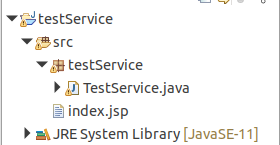

# YAWL-JADEX Custom Service

## Tutorial criação e configuração do Custom service

1. Crie um Java Project no Eclipse com a seguinte estrutura:

    

    O modelo do código pode ser verificado no próprio repositório na pasta `testService`

2. Importe os pacotes Java que está em (`/PATH/YAWL-4.3.1/engine/apache-tomcat-7.0.65/yawllib`), em que `PATH` é o local de instalação padrão do seu YAWL. Para isso:
   - Clique com o mouse direito no projeto, selecione `Build Path`, `Configure Build Path`. Clique na aba `Libraries`, e selecione `Add External JARS`.
   - Abra a pasta `/PATH/YAWL-4.3.1/engine/apache-tomcat-7.0.65/yawllib` e selecione os arquivos necessários(se necessário, importe todos). Por fim, clique em `Apply and Close`

3. Exporte a pasta do projeto no eclipse na forma `file system`. Com isso estruture, o projeto conforme a estrutura padrão do `war file`, conforme o exemplo da pasta `testService` do repositório. Atente-se a estrutura do `web.xml`, pois ela ditará ao YAWL Engine a interface entre ela e o Custom Service.

    *Nota: Para a pasta `WEB-INF/lib`, copie os arquivos `jars` que foram importados no passo 2. Na pasta `WEB-INF/classes`, coloque o `.java` do Custom Service que você criou.

4. Compacte o projeto no formato war. No Linux, abra o terminal, entre na pasta do projeto exportado, e dentro dela crie um `war file`:

    ```$ jar -cvf projectname.war *```

    No Windows, basta clicar no projeto e exportar com `war file`.

5. Abra a engine do YAWL e coloque ela pra rodar. Depois, mova o `war file` para a pasta `/PATH/YAWL-4.3.1/engine/apache-tomcat-7.0.65/webapps/`.

6. Acesse `http://localhost:8080/resourceService`, faça o login, e acesse a aba `Services`.
  
7. Nela, preencha os campos conforme especificado no `web.xml` e adicione o Custom Service. Atente-se que o `.java` e o `web.xml` devem conter o login e password iguais!

8. Pronto, agora você possui um Custom Service configurado e pronto para ser utilizado =). 